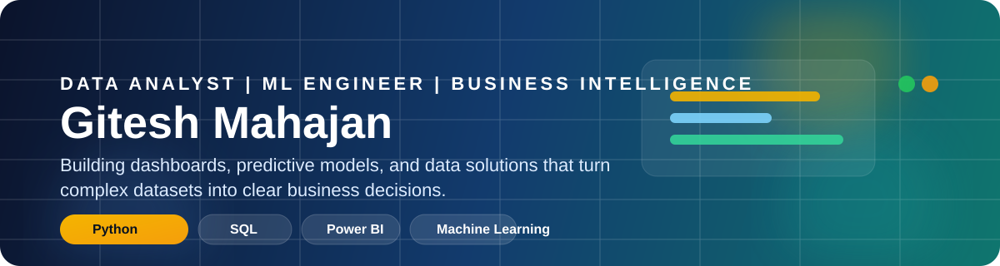

  

  
  
  

  
  
  

## [About Me](https://giteshmahajan.vercel.app/)

I am a Data Analyst and ML Engineer with a strong foundation in Python, SQL, Power BI, ETL pipelines, and machine learning. My focus is simple: transform complex data into dashboards, insights, and predictive solutions that help teams make better business decisions.

I bring a blend of analytics, BI, and ML exposure through academic training, internship experience, and project work in healthcare and hospitality analytics.

## Career Snapshot

<table>
  <tr>
    <td width="33%">
      <h3>Analytics</h3>
      
SQL querying, reporting, data cleaning, KPI tracking, and business insight generation.

    </td>
    <td width="33%">
      <h3>Business Intelligence</h3>
      
Interactive Power BI dashboards, DAX measures, data modeling, and stakeholder-focused reporting.

    </td>
    <td width="33%">
      <h3>Machine Learning</h3>
      
Predictive modeling, NLP exposure, recommendation systems, and Python-based ML workflows.

    </td>
  </tr>
</table>

## What I Bring

- Build dashboards that make KPIs easy to monitor and act on.
- Clean, transform, and analyze data using Python, Pandas, NumPy, SQL, and Excel.
- Create end-to-end analytics workflows from raw data to executive-ready reporting.
- Apply ML techniques to solve business and user-focused problems.
- Work across analytics, visualization, and big data tools with a practical mindset.

## Tech Stack

### Data and Programming

### BI and Visualization

### ML, AI, and Big Data

### Tools

## Experience

### Data Analyst Intern | Sumago Infotech Pvt. Ltd. | Pune | 2024

- Developed and optimized SQL queries and stored procedures to improve reporting efficiency.
- Built interactive Power BI dashboards for KPI tracking and business trend analysis.
- Performed data cleaning, transformation, and analysis using Python and Excel.
- Worked with cross-functional teams across the SDLC to support data-driven delivery.

### Simulation Internships

- Data Visualization Analyst - Tata (Forage)
- Data Analytics - Deloitte (Forage)

## Education

- PG Diploma in Big Data Analytics, C-DAC Bengaluru | 2025-2026
- MCA, JSPM Rajarshi Shahu College of Engineering, Pune | 2022-2024
- BCA, Modern College of Arts, Science and Commerce, Pune | 2019-2022

## Certifications and Recognition

- Best Performance of the Month - Sumago Infotech
- Data Visualization: Empowering Business with Effective Insights - Forage
- Tata Data Analytics Job Simulation - Forage
- Data Visualization with Power BI - Great Learning Academy

## Connect

  If you are hiring for Data Analyst, BI Analyst, or ML-focused roles, I would be glad to connect.

  <a href="mailto:giteshmahajan01@gmail.com">Email</a> |
  <a href="https://www.linkedin.com/in/gitesh-mahajan-272916228/">LinkedIn</a> |
  <a href="./Gitesh_M_Resume.pdf">Resume</a>

